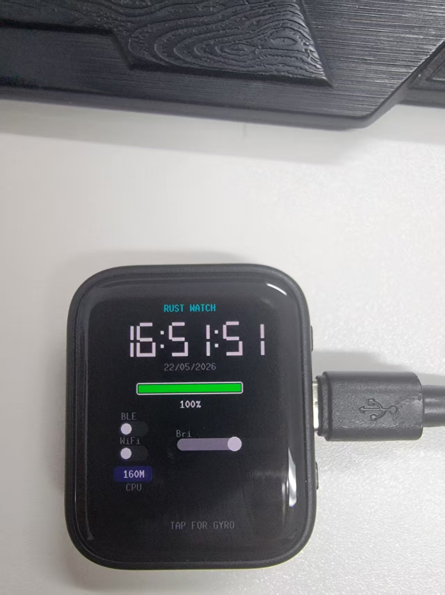
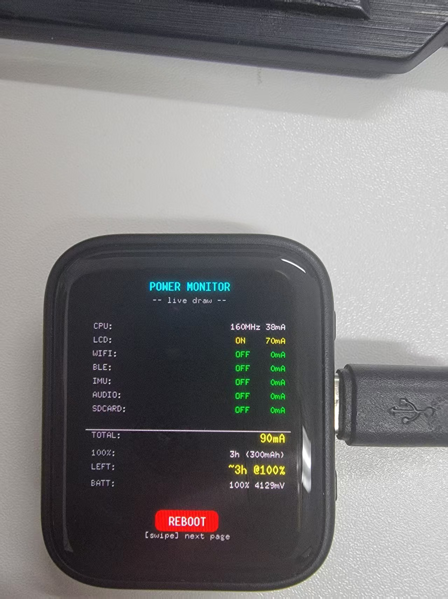
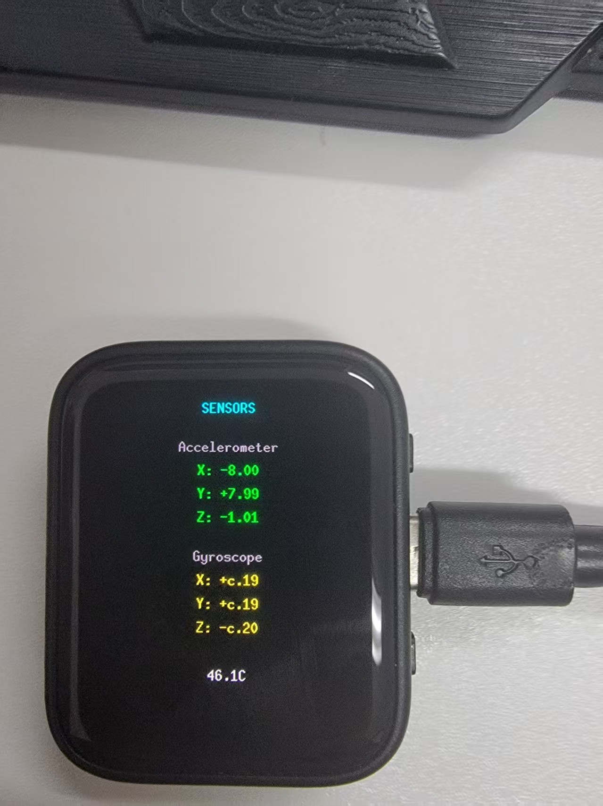
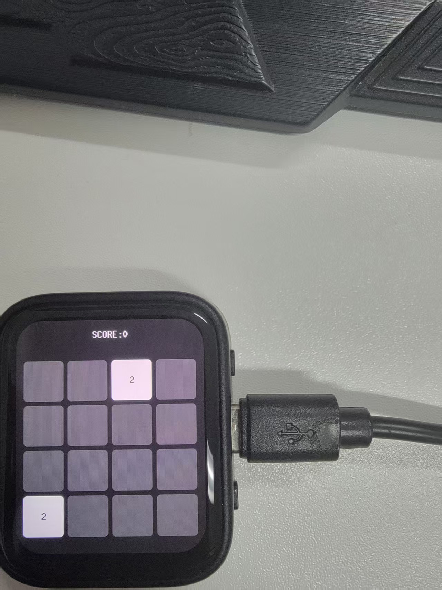
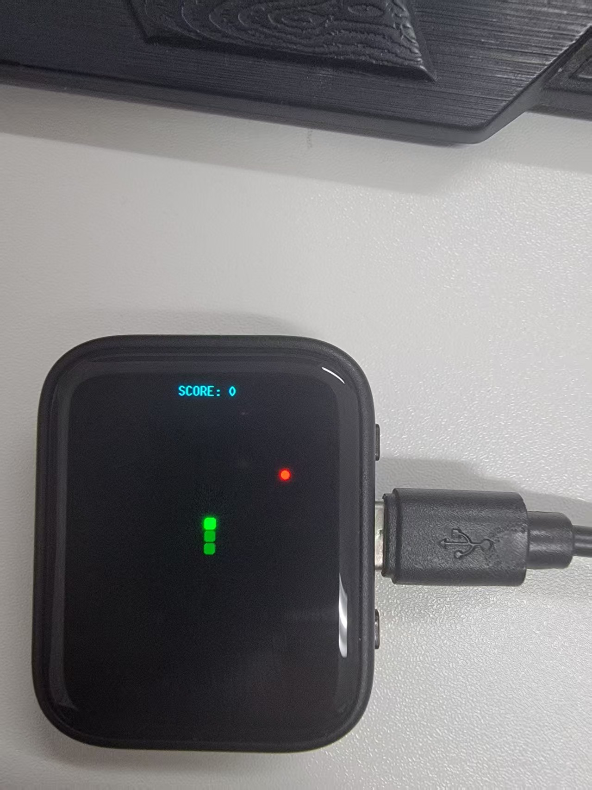
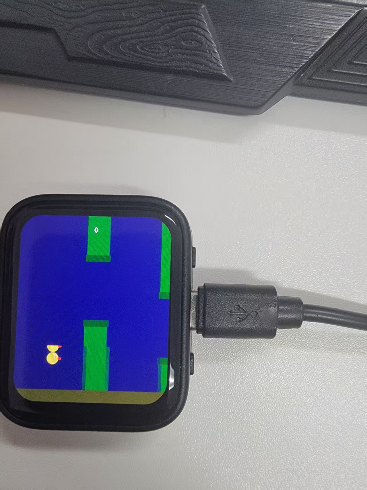
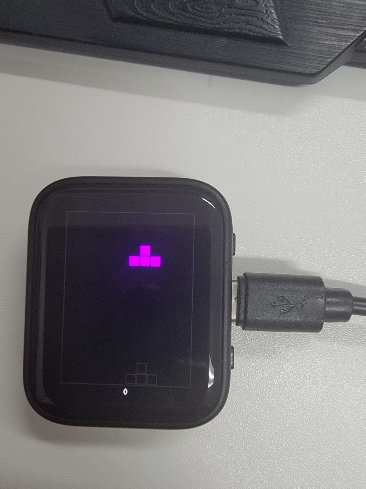

# waveshare-watch-rs-AMOLED-1.8
使用chatgpt coding适配 的 https://docs.waveshare.net/ESP32-S3-Touch-AMOLED-1.8/ 

#source code form （same build ）
https://github.com/infinition/waveshare-watch-rs

#demo

#need todo
mic record & play
sip call (this is idf):https://www.bilibili.com/video/BV1EY9rBnEyv/
